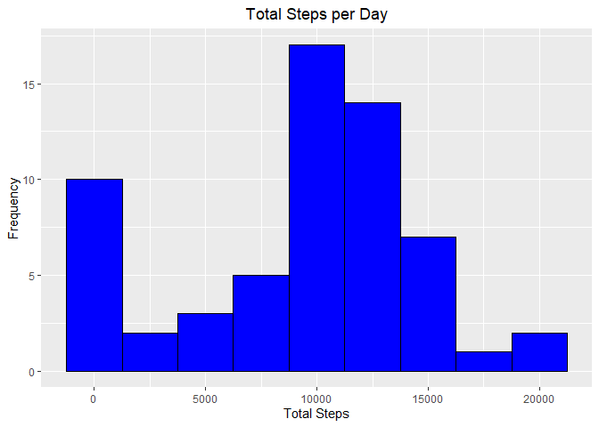
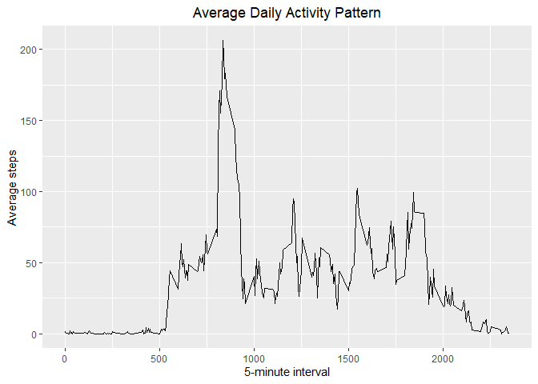
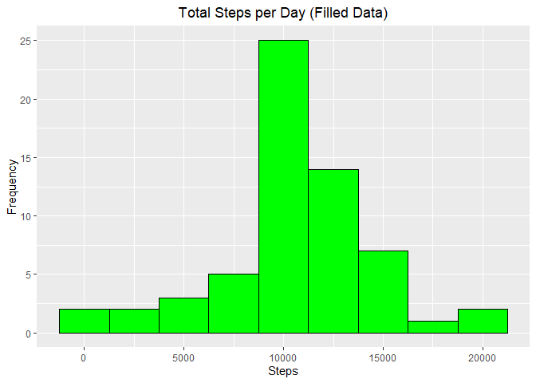
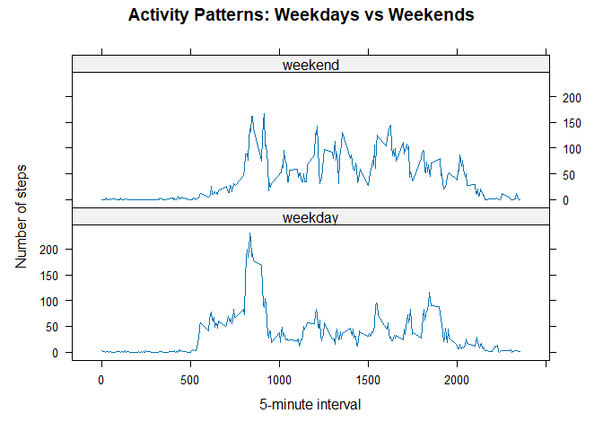

## Loading and preprocessing the data

Load the data.

``` r
activity_data <- read.csv(unz("activity.zip", "activity.csv"))

str(activity_data)
```

```
## 'data.frame':	17568 obs. of  3 variables:
##  $ steps   : int  NA NA NA NA NA NA NA NA NA NA ...
##  $ date    : chr  "2012-10-01" "2012-10-01" "2012-10-01" "2012-10-01" ...
##  $ interval: int  0 5 10 15 20 25 30 35 40 45 ...
```

Convert date column to Date format.

``` r
activity_data$date <- as.Date(activity_data$date)
```

## What is mean total number of steps taken per day?

Plot a histogram of the total number of steps taken each day.

``` r
total_steps_per_day <- activity_data %>%
        group_by(date) %>%
        summarise(total_steps = sum(steps, na.rm = TRUE))

ggplot(total_steps_per_day, aes(x = total_steps)) +
        geom_histogram(binwidth = 2500, fill = "blue", color = "black") +
        labs(title = "Total Steps per Day", x = "Total Steps", y = "Frequency") +
        theme(plot.title = element_text(hjust = 0.5))
```

<!-- -->

Calculate the **mean** and **median** total number of steps taken per day.

``` r
mean(total_steps_per_day$total_steps)
```

```
## [1] 9354.23
```

``` r
median(total_steps_per_day$total_steps)
```

```
## [1] 10395
```

The mean total number of steps per day is **9354**, and the median is **10395**.

## What is the average daily activity pattern?
Make a time series plot of the 5-minute interval (x-axis) and the average number of steps taken, averaged across all days (y-axis).

``` r
avg_steps_per_interval <- activity_data %>%
        group_by(interval) %>%
        summarize(avg_steps = mean(steps, na.rm = TRUE))

ggplot(avg_steps_per_interval, aes(x = interval, y = avg_steps)) +
        geom_line() +
        labs(x = "5-minute interval", y = "Average steps", title = "Average Daily Activity Pattern") +
        theme(plot.title = element_text(hjust = 0.5))
```

<!-- -->


``` r
avg_steps_per_interval[which.max(avg_steps_per_interval$avg_steps), ]
```

```
## # A tibble: 1 × 2
##   interval avg_steps
##      <int>     <dbl>
## 1      835      206.
```

The 5-minute interval that contains the maximum average number of steps across all the days in the dataset is interval **835**, with an average of **206** steps.

## Imputing missing values

Calculate the total number of missing values in the dataset (i.e. the total number of rows with NAs).

``` r
sum(is.na(activity_data$steps))
```

```
## [1] 2304
```

Fill in missing values using the mean for that 5-minute interval.

``` r
activity_data_filled <- activity_data %>%
        group_by(interval) %>%
        mutate(steps = ifelse(is.na(steps), mean(steps, na.rm = TRUE), steps))

head(activity_data_filled)
```

```
## # A tibble: 6 × 3
## # Groups:   interval [6]
##    steps date       interval
##    <dbl> <date>        <int>
## 1 1.72   2012-10-01        0
## 2 0.340  2012-10-01        5
## 3 0.132  2012-10-01       10
## 4 0.151  2012-10-01       15
## 5 0.0755 2012-10-01       20
## 6 2.09   2012-10-01       25
```

Plot a histogram of the total number of steps taken each day.

``` r
total_steps_filled <- activity_data_filled %>%
        group_by(date) %>%
        summarize(total_steps = sum(steps))

ggplot(total_steps_filled, aes(x = total_steps)) +
        geom_histogram(binwidth = 2500, fill = "green", color = "black") +
        labs(title = "Total Steps per Day (Filled Data)", x = "Steps", y = "Frequency") +
        theme(plot.title = element_text(hjust = 0.5))
```

<!-- -->

Calculate the **mean** and **median** total number of steps taken per day for filled data.

``` r
mean(total_steps_filled$total_steps)
```

```
## [1] 10766.19
```

``` r
median(total_steps_filled$total_steps)
```

```
## [1] 10766.19
```

The mean and median total number of steps per day for the filled data are both **10766**.

The values differ from the estimates in the first part of the assignment. After imputing missing data, the mean and median total number of steps per day increased because the missing values (which were previously contributing zero to the total steps) are now replaced by the mean number of steps for each 5-minute interval. This reduces the overall variability and "fills in" lower daily step counts, leading to a more balanced distribution. The impact of imputing missing data is that it provides a more accurate and complete estimate of the total daily steps, smoothing out the distribution and bringing the mean and median closer together.

## Are there differences in activity patterns between weekdays and weekends?


``` r
# Create weekday/weekend factor
activity_data_filled <- activity_data_filled %>%
        mutate(day_type = ifelse(weekdays(date) %in% c("Saturday", "Sunday"), "weekend", "weekday"))

# Average steps per interval by day type
avg_steps_day_type <- activity_data_filled %>%
        group_by(interval, day_type) %>%
        summarize(avg_steps = mean(steps))

# Panel plot using lattice
xyplot(avg_steps ~ interval | day_type, data = avg_steps_day_type, 
       type = "l", 
       layout = c(1, 2),
       xlab = "5-minute interval", 
       ylab = "Number of steps", 
       main = "Activity Patterns: Weekdays vs Weekends")
```

<!-- -->

There are noticeable differences in activity patterns between weekdays and weekends. Activity levels on weekends tend to show more variability. On weekdays, activity patterns are more structured and consistent, with peaks during morning and evening hours.
